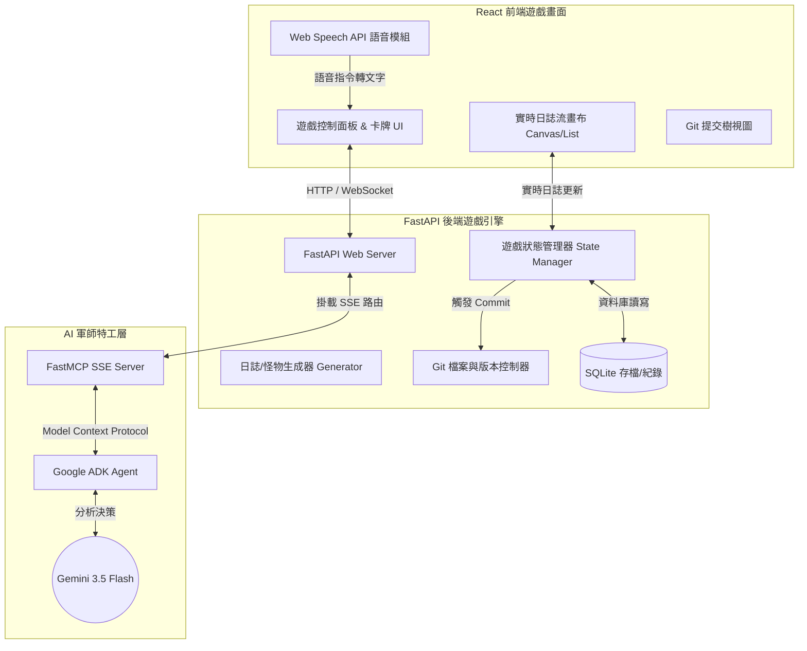

# 🎮 專案詳細架構：AI 網頁防禦卡牌遊戲 (CrawlShield RPG)

本文件詳細規劃了 **AI 網頁防禦卡牌遊戲 (CrawlShield RPG)** 的系統架構、核心機制、資料流向與技術整合，協助你為期末 Demo 做好完整的開發藍圖。

---

## 🏗️ 系統架構圖 (System Architecture)

本專案採用前後端分離架構，整合了 **FastAPI** 遊戲引擎、**FastMCP (SSE)** 協議、**Google ADK Agent** 以及 **React 前端遊戲畫面**。



---

## 🕹️ 核心遊戲機制 (Gameplay Mechanics)

你將扮演城堡的 **網站管理員 (Admin)**，守護你的核心主機。

### 1. 遊戲勝敗條件
*   **血量 (Server HP)**: 初始值 `100`。當惡意 Hacker 爬蟲入侵成功，HP 會扣減。HP = 0 時遊戲結束（伺服器當機）。
*   **積分 (SEO Rank)**: 初始值 `50`。當友善搜尋爬蟲（如 Googlebot）成功索引網站，積分上升；若被 AI 爬蟲竊取過多專利資料或封鎖了 Googlebot，積分下降。積分 = 0 時遊戲結束（網站沒有流量，失去商業價值）。
*   **通關條件**: 在日誌波次（Wave）結束時，同時保持 HP > 0 且 SEO Rank > 80。

### 2. 怪物設定 (模擬日誌流量)
每回合日誌流會滾動出現 3~5 條訪問記錄，它們是代表不同威脅的「怪物」：
*   **「惡意駭客 (Hacker Bot)」**：
    *   *特徵*：請求 `/.env`、`/wp-admin` 或 SQL 注入。
    *   *效果*：如果不予理會，會扣減 Server HP `10` 點。
*   **「AI 內容強盜 (GPTBot / ClaudeBot)」**：
    *   *特徵*：高頻率請求文章目錄 `/articles/page-1`。
    *   *效果*：若沒在 robots.txt 限制它，它會下載所有內容，扣減 SEO 分數 `5` 點（內容被偷走）；若成功限制它，則防禦成功。
*   **「搜尋引擎使者 (Googlebot / Bingbot)」**：
    *   *特徵*：請求 `/sitemap.xml` 或 `/`。
    *   *效果*：如果被你誤殺（用 Regex 擋掉），SEO 分數扣 `15`；若放行，SEO 分數加 `10`。
*   **「一般使用者 (Human)」**：
    *   *特徵*：請求 `/index.html`。放行可增加微量 SEO 分數，不會造成威脅。

### 3. 防禦卡牌與 Regex 魔法 (The Regex Deck)
你的手牌是一張張寫著 **正規表示式** 的卡片：
*   卡牌 A：`^192\.168\..*` (防禦區域網路內鬼攻擊)
*   卡牌 B：`\.(env|git|conf)$` (防禦設定檔洩漏)
*   卡牌 C：`.*(GPTBot|ClaudeBot).*` (隔離 AI 訓練爬蟲)
*   卡牌 D：`SELECT .* FROM` (防禦 SQL 注入)
*   卡牌 E：`.*Googlebot.*` (允許/加成 搜尋引擎存取)

**出牌方式**：你可以點擊卡片、用鍵盤輸入，或**使用 Web Speech API 大聲唸出 Regex 規則**（例如：「發動正規表示式：點 env 點 git 錢字號！」）。
成功發動後，畫面上所有匹配該 Regex 的日誌行會**即時被雷射光束射擊高亮並消失**（代表防禦成功）。

### 4. 戰術防禦：Robots.txt 魔法陣
在每回合（Wave）開始前的「備戰階段」，你可以編輯網站的 `robots.txt`：
*   如果寫入：
    ```txt
    User-agent: GPTBot
    Disallow: /
    ```
    那麼下一波 GPTBot 出現時，它會讀到 Disallow 規則並自動撤退，不扣減你的分數。
*   如果你寫入：
    ```txt
    User-agent: *
    Disallow: /
    ```
    所有爬蟲（包括 Googlebot）都會撤退，但你的 SEO 分數會因為「全站無法被索引」而每回合暴跌。這考驗你對 SEO 規則的理解！

---

## 🧠 AI 軍師 (ADK Agent) 與 MCP 串接設計

AI Agent 在這款遊戲中扮演你的 **「軍師 (Advisor)」**，提供即時策略與教學。

### MCP 提供之 Tools 接口 (`mcp_server.py`)
1.  `get_current_wave_state()`: 讓 AI 獲取當前的 Server HP、SEO 分數、以及即將來襲的日誌序列。
2.  `get_player_hand()`: 讓 AI 知道玩家手上有哪些 Regex 卡牌。
3.  `analyze_regex_matching(regex, log_line)`: 提供 Regex 測試，讓 AI 能計算如果玩家出某張牌，能消滅多少怪物。
4.  `apply_security_patch(patch_code)`: 讓 AI 幫忙修改 `robots.txt`。

### AI Agent 的決策邏輯 (System Prompt)
*   AI 會透過 MCP 分析戰局，當發現玩家手上有 `\.(env|git)$` 但日誌流中正有 Hacker 在掃描 `.env` 時，AI 會用語音或文字大喊：「*主公快出卡牌 B！有駭客正在偷看我們的環境設定檔！*」
*   如果玩家忘記修改 `robots.txt` 導致 AI 爬蟲一直在偷取資料，AI 會警告：「*GPTBot 正在大量下載我們的專利資料，建議修改 robots.txt 來限制它！*」

---

## 💾 Git 版本控制的巧妙融入

我們將 **Git 的 Commit & Reset 機制** 包裝成遊戲的**「存檔點與時光機」**：

1.  **回合 Commit**：每當你通過一個 Wave，後端會自動將你的 `robots.txt`、黑名單設定及目前的遊戲分數（HP/SEO）寫入檔案，並執行：
    ```bash
    git add game_config.json robots.txt
    git commit -m "Wave {N} Completed - HP: {HP}, SEO: {SEO_Rank} (AI-Assisted)"
    ```
2.  **時光倒流 (Git Reset)**：如果下一回合你不小心出錯牌，導致伺服器 HP 歸零 Game Over，你可以點擊「時光倒流」按鈕。遊戲會執行：
    ```bash
    git reset --hard HEAD~1
    ```
    回到上一個存檔點，這不僅展示了 Git 的功能，還賦予了遊戲「重來」的趣味性！

---

## 🎨 前端畫面佈局與動態設計 (UI/UX)

為了讓 Demo 驚艷全場，UI 必須有極強的視覺張力：
*   **主色調**：霓虹綠（安全/正常日誌）、霓虹紅（駭客攻擊）、酷炫金（Googlebot）、深灰底色。
*   **Web Speech 指示燈**：右上角有一個麥克風圖示。說話時圖示閃爍綠光，並在畫面上即時顯示語音轉譯出來的 Regex 卡牌名稱。
*   **日誌流特效**：未處理的日誌會像瀑布一樣往下滾動。當滑鼠懸停在 Regex 卡牌上時，畫面中會被該 Regex 匹配的日誌行會**即時閃爍**，提示玩家出這張牌的效果。
*   **Git 歷史樹**：底部顯示一個圓點連線的 Git commit 樹，滑鼠移過去可以看到當時那一關通關時的血量和策略。

---

## 📋 開發分工與步驟

如果你決定進行這個專案，我們可以按照以下步驟一步步開發：

*   `[ ]` **步驟一**：建立 FastAPI 後端與 Log 生成器，用 Regex 解析 Log 並寫入 SQLite。
*   `[ ]` **步驟二**：實作 GitManager，用 Python 程式碼控制本地 Git commit 與 reset。
*   `[ ]` **步驟三**：使用 FastMCP 定義後端 Tool，並用 Google ADK 設定 AI 軍師的 Prompt。
*   `[ ]` **步驟四**：建立 React 前端，完成精美的黑客風 Log 串流與卡牌 UI。
*   `[ ]` **步驟五**：整合 Web Speech API 實現語音出牌。
*   `[ ]` **步驟六**：容器化部署 (Docker-Compose) 與 Demo 測試。

**這套架構設計完整地將你學過的所有技術封裝進一個「遊戲化」的場景中，兼具深度與趣味。你有什麼想法，或想先從後端還是前端開始著手？**
